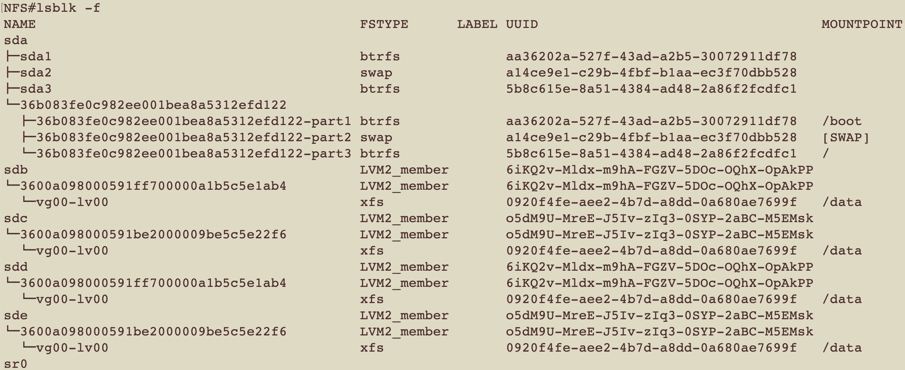
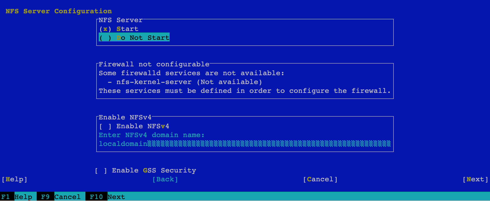
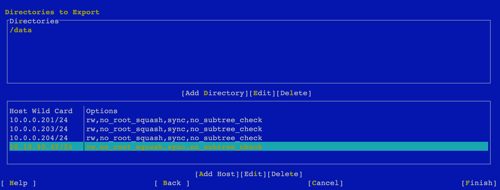

# Configuring NFS Server in OpenSuse Leap 15
## install requiered packages
```
zypper install -y yast2-nfs-server multipath-tools
```

## configuring multipath devices


## configuring NFS Server
```
yast nfs_server
```



## open firewalld

```
#firewall-cmd --list-services
ssh mdns samba-client dhcpv6-client
#firewall-cmd --set-default-zone=internal
#firewall-cmd --get-active-zones
internal
  interfaces: p2p1 em2
#firewall-cmd --state 
running
#firewall-cmd --set-default-zone=internal
#firewall-cmd --list-services 
ssh mdns samba-client dhcpv6-client
#firewall-cmd --add-service=nfs --permanent 
success
#firewall-cmd --zone=internal --add-service=rpc-bind --permanent
success
#firewall-cmd --add-service=nfs3 --permanent
success
#firewall-cmd --add-service=mountd --permanent
success
#firewall-cmd --reload
success
#firewall-cmd --list-services 
ssh mdns samba-client dhcpv6-client nfs rpc-bind
```

